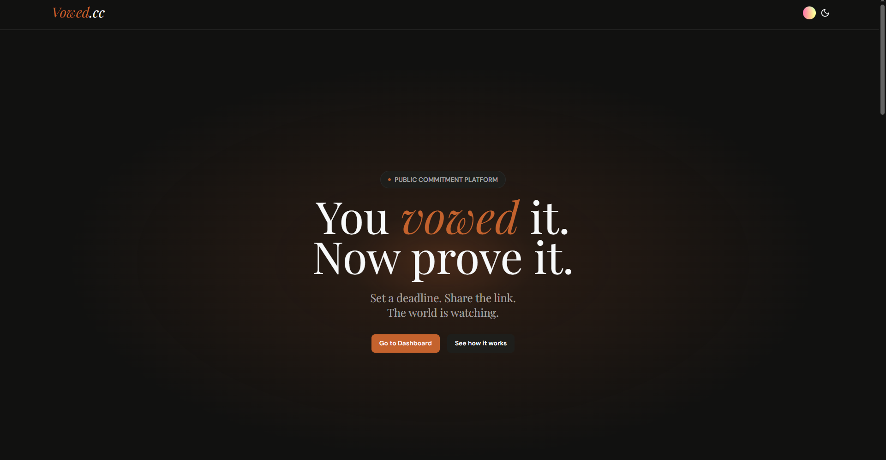

# Vowed

A platform for public commitments. You make a promise to yourself. You put it somewhere people can see it. That changes things.

Most promises to ourselves dissolve quietly. No one sees. No one cares. Nothing stops them from fading away.

## The problem

You make promises to yourself and they disappear. Nothing makes them stick. You need something that makes them real. Public. That you can't just abandon.

Vowed does that.

## How it works

You create a vow. You pick a deadline. You choose who sees it. Public, unlisted, or private.

When the deadline arrives, you resolve it. You say whether you kept it or didn't. That stays there forever. Your fulfillment rate becomes visible. People see whether you keep your word.

## What this is not

This is not a productivity tool. No streaks, no gamification, no tricks. This is just commitment and visibility and a permanent record.

It works if you care about your reputation. It works if your word means something to you.

## Why build this

Most accountability platforms try to manipulate you through points and badges. They're designed to keep you addicted, not to help you actually change.

Vowed is different. It's just visibility and honesty. You put your word out there. People see if you kept it. That's the mechanism. Nothing else.

No pseudo-science. No psychological manipulation. Just the fact that you don't want to look like someone who doesn't keep their promises.

## Built with

Next.js, React, Firebase, Clerk, Tailwind CSS

## The person behind this

I'm Hasan. I work on things I think should exist. I wanted somewhere to put my promises that made them real. So I built it.

You can find me here:

[GitHub](https://github.com/delta6626) / [X](https://x.com/delta6626) / [Email](mailto:hasan04.asm@gmail.com)
